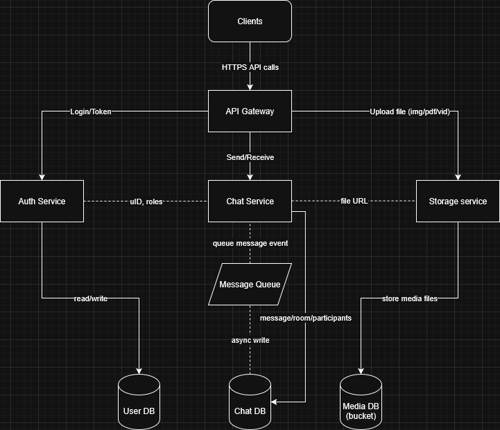
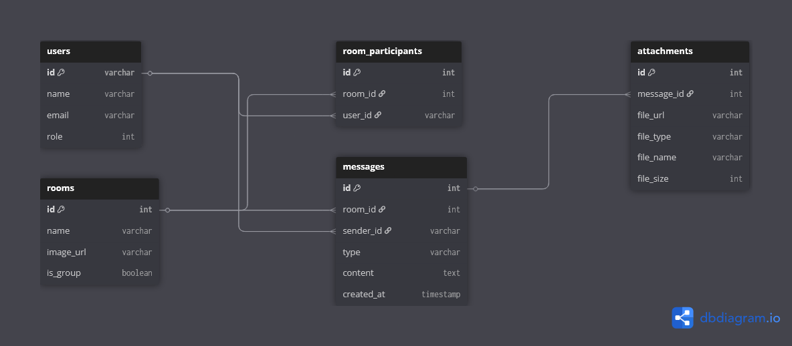
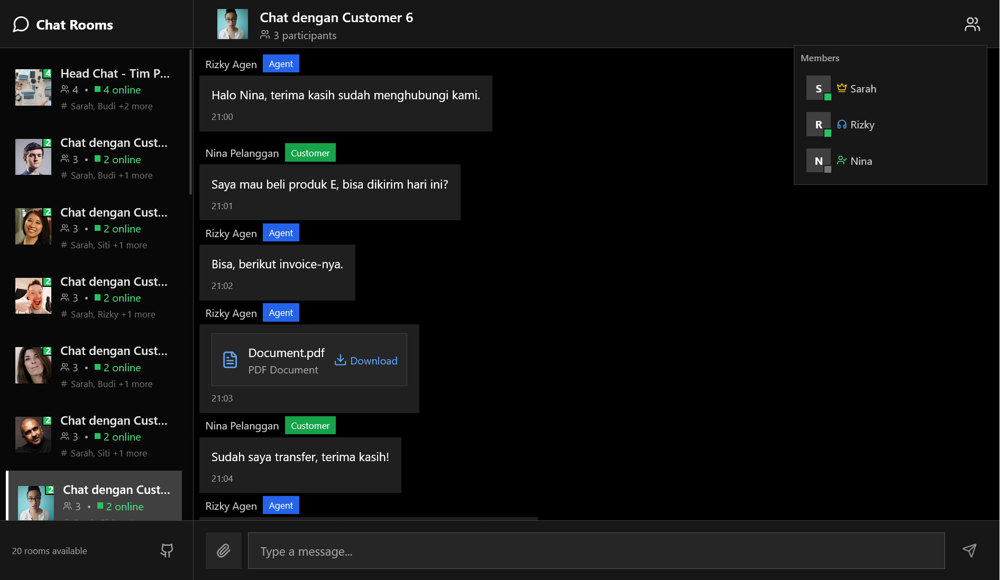
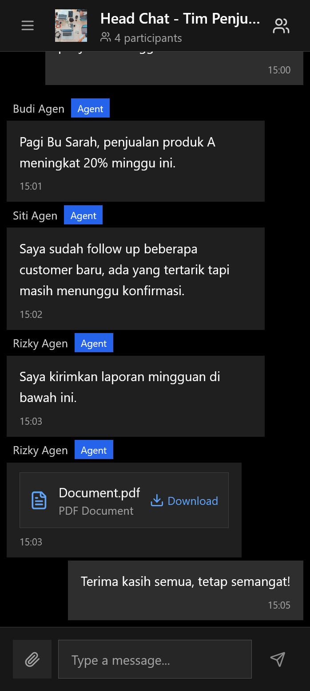

# Group Chat Application

## Introduction

A modern, monochrome-themed group chat application built with React, TypeScript, Vite, and Tailwind CSS. This project demonstrates a clean, accessible, and highly customizable chat UI, suitable for both desktop and mobile devices.


## Chat Data Format

This project uses a sample chat data file at [`public/chat.json`](./public/chat.json) for local development and UI prototyping.

- **Local JSON:** [`public/chat.json`](./public/chat.json)
- **Extended JSON Example:** [chat_response.json (gist)](https://gist.githubusercontent.com/asharijuang/23745f3132fa30e666db68d2bf574e4a/raw/5d556dbb9c2aea9fdf3e1ec96e45f62a88cea7b6/chat_response.json)

### Comparison

| Feature                | `chat.json` (local)         | Extended JSON (gist)         |
|------------------------|-----------------------------|------------------------------|
| Rooms                  | Yes                         | Yes                          |
| Participants           | Yes                         | Yes                          |
| Message Types          | text, image, video, pdf     | text, image, video, pdf, ... |
| Attachments            | Inline (in message object)  | May be separate/linked       |
| Timestamps             | ISO 8601                    | ISO 8601                     |
| Realistic Data Volume  | Small (demo)                | Larger, more realistic       |
| API Structure          | Flat, simple                | Nested, closer to real API   |
| Usage                  | UI demo, local dev          | Backend/API integration      |

See the [extended JSON example](https://gist.githubusercontent.com/asharijuang/23745f3132fa30e666db68d2bf574e4a/raw/5d556dbb9c2aea9fdf3e1ec96e45f62a88cea7b6/chat_response.json) for a more complete API-style response.

---

## System Overview

This project is a **group chat system** that supports sending messages, including text, images, videos, and PDF files. It’s designed to be scalable and modular using a service-based architecture. Below is a breakdown of how it works:

### System Architecture



* **Clients**: Users interact with the app (mobile or web) and send/receive messages.
* **API Gateway**: The central entry point for all communication. It forwards requests to the appropriate services.
* **Auth Service**: Handles user login, access tokens, and checking roles (admin, agent, customer).
* **Chat Service**: Core logic for sending and receiving messages. It creates chat rooms, handles participants, and formats messages.
* **Storage Service**: Manages uploaded files (images, videos, PDFs), returns URLs to be saved with messages.
* **Message Queue**: Buffers incoming messages before saving, so the system can scale and process things asynchronously.
* **Databases**:

  * `User DB`: Stores account info.
  * `Chat DB`: Stores rooms, participants, and messages.
  * `Media DB`: Stores uploaded media files.

---

## Database Schema



Here’s a breakdown of the database design:

### 🧍‍♂️ `users`

Stores all registered users.

```sql
id         -- unique user ID (email or UUID)
name       -- display name
email      -- user email
role       -- 0 = admin, 1 = agent, 2 = customer
```

### 💬 `rooms`

Each chat room (group or private chat).

```sql
id          -- room ID
name        -- name of the room
image_url   -- avatar image for the room
is_group    -- boolean: true if group, false if 1-on-1
```

### 👥 `room_participants`

Links users to rooms.

```sql
id          -- record ID
room_id     -- which room
user_id     -- which user
```

### ✉️ `messages`

Every message sent in a room.

```sql
id          -- message ID
room_id     -- where it was sent
sender_id   -- who sent it
type        -- text, image, video, pdf
content     -- message text or file URL
created_at  -- timestamp
```

### 📎 `attachments`

Used only when message type is not text.

```sql
id          -- attachment ID
message_id  -- linked to the message
file_url    -- actual file location
file_type   -- image/pdf/video
file_name   -- original filename
file_size   -- in bytes
```

## Features

- **Group chat rooms** with participant roles (Admin, Agent, Customer)
- **Responsive sidebar** for room navigation, collapses on mobile
- **Message bubbles** for outgoing/incoming messages
- **File upload support** (image, video, PDF)
- **Role-based color coding** for participants
- **Custom UI components** (buttons, popovers, tooltips, toasts, etc.)
- **Dark/monochrome theme** with Tailwind and CSS variables
- **Accessible keyboard navigation** and focus styles
- **Animated transitions** for UI elements


## User Interface

<div align="center">
  <table>
    <tr>
      <td align="center"><br /><b>Desktop UI</b></td>
      <td align="center"><br /><b>Mobile UI</b></td>
    </tr>
  </table>
</div>

## Getting Started

1. **Install dependencies:**
   ```bash
   bun install
   # or
   npm install
   ```

2. **Start the development server:**
   ```bash
   bun run dev
   # or
   npm run dev
   ```

3. **Open** [http://localhost:5173](http://localhost:5173) in your browser.

## Project Structure

- `src/components/` – Reusable UI and chat components
- `src/pages/` – Main app pages (e.g., `ChatApp.tsx`)
- `src/types/` – TypeScript interfaces for chat data
- `public/` – Static assets and mock chat data

## What to Do Next

- **Connect to a backend:** Integrate real-time messaging (e.g., with WebSocket, Firebase, or your own API)
- **Authentication:** Add user login and role management
- **Persistence:** Store chat history and user preferences
- **Notifications:** Implement push or in-app notifications
- **Testing:** Add unit and integration tests for components and logic
- **Accessibility:** Further improve ARIA roles and keyboard support
- **Deployment:** Prepare for production and deploy (e.g., Vercel, Netlify)

---

